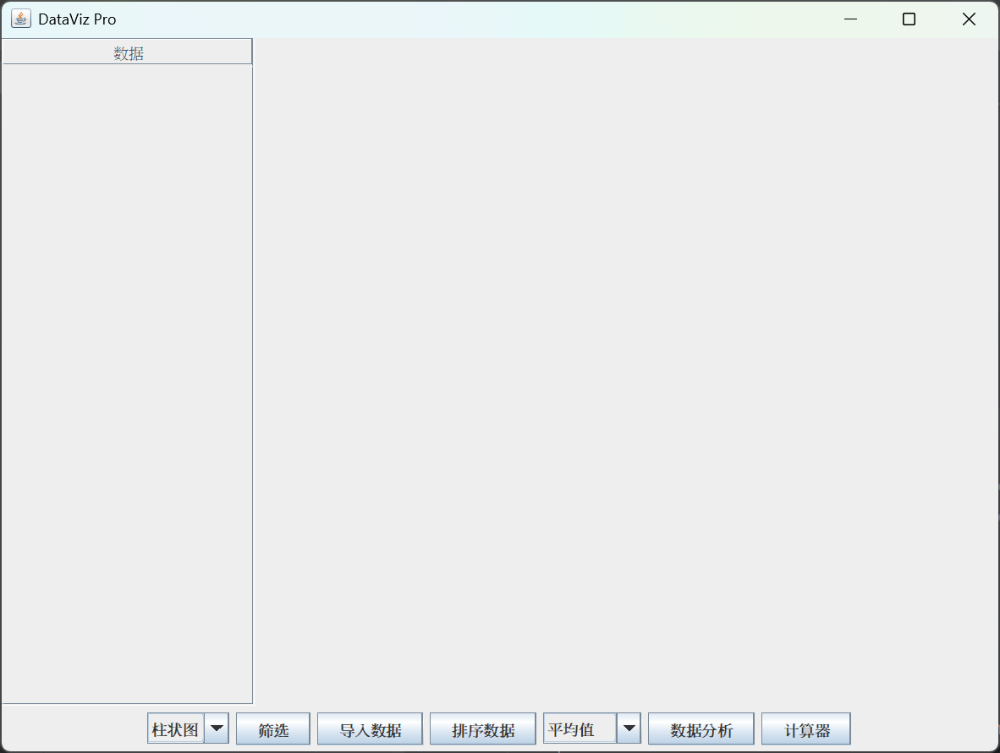

# DataViz-Pro

## How to use it?
### Step 1
#### Choose and import your data by clicking "导入数据".
### Step 2
#### (Option) You can sort your data by clicking "排序数据" and filter them through "筛选"
#### Then you can select the analysis mode. 
#### Currently, 'Mean', 'Median','Variance', 'Standard Deviation','Data Range' and 'Quartile' are available.
### Step 3
#### Eventually, by clicking "数据分析", the variation and analysis of data will display for you.
### Step 4
#### Now, ByteDance is accessible.Have a try by clicking the combobox on the left.
